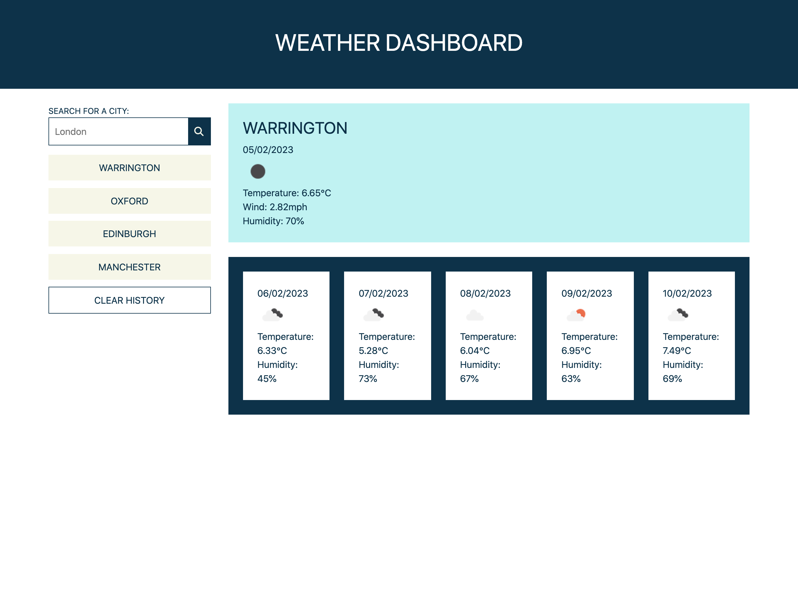

# Weather Dashboard

## Description
Week 08: Challenge 08 – Weather Dashboard

This is a web application that uses the Open Weather Map API to retrieve weather data for a given city. When the user inputs a city and clicks the search button, the code will retrieve the weather forecast for that city. It displays a history of all previously searched locations as buttons, which can be clicked to retrieve the same weather data again. A handy web application for travellers who need a place to collate weather information for multiple cities at once.

## Installation

N/A

View site at: https://zwirled.github.io/weather-dashboard/

## Usage

## Credits

- EdX Bootcamp Starter code

## License

MIT License

Copyright (c) [2023] [Amelia Bramwell]

Permission is hereby granted, free of charge, to any person obtaining a copy of this software and associated documentation files (the "Software"), to deal in the Software without restriction, including without limitation the rights to use, copy, modify, merge, publish, distribute, sublicense, and/or sell copies of the Software, and to permit persons to whom the Software is furnished to do so, subject to the following conditions:

The above copyright notice and this permission notice shall be included in all copies or substantial portions of the Software.

THE SOFTWARE IS PROVIDED "AS IS", WITHOUT WARRANTY OF ANY KIND, EXPRESS OR IMPLIED, INCLUDING BUT NOT LIMITED TO THE WARRANTIES OF MERCHANTABILITY, FITNESS FOR A PARTICULAR PURPOSE AND NONINFRINGEMENT. IN NO EVENT SHALL THE
AUTHORS OR COPYRIGHT HOLDERS BE LIABLE FOR ANY CLAIM, DAMAGES OR OTHER LIABILITY, WHETHER IN AN ACTION OF CONTRACT, TORT OR OTHERWISE, ARISING FROM, OUT OF OR IN CONNECTION WITH THE SOFTWARE OR THE USE OR OTHER DEALINGS IN THE SOFTWARE.
